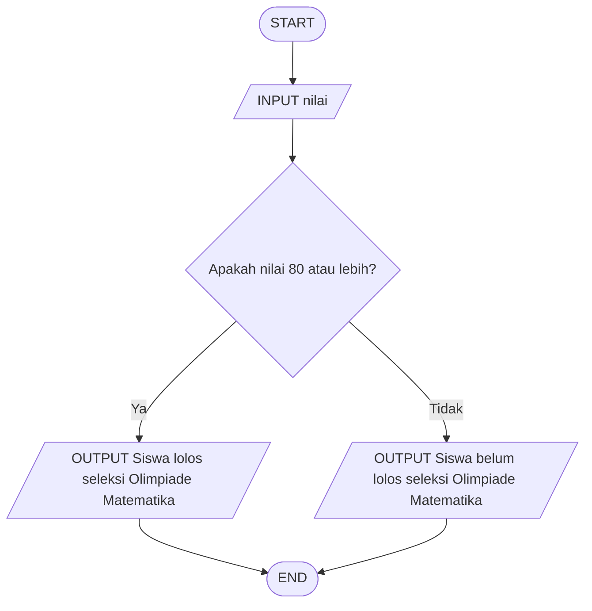

# 🧮 Logika Matematika - Menentukan Kelolosan Seleksi Olimpiade Matematika

## 📝 **Deskripsi Masalah**

Di sebuah sekolah menengah atas (SMA), terdapat program seleksi siswa untuk mengikuti Olimpiade Matematika tingkat sekolah. Siswa yang mendapatkan nilai tes seleksi **80 atau lebih** dinyatakan lolos seleksi, sedangkan siswa yang mendapatkan nilai **kurang dari 80** dinyatakan belum lolos seleksi.

Masalah ini dapat digunakan untuk menerapkan logika matematika dalam menentukan suatu keputusan berdasarkan kondisi yang diberikan.

Program akan menerima nilai tes seleksi matematika siswa sebagai input, kemudian mengevaluasi apakah nilai tersebut mencapai batas minimal kelulusan atau tidak. Berdasarkan hasil evaluasi tersebut, program akan menentukan apakah siswa lolos seleksi Olimpiade Matematika atau belum lolos.

## 📥 **Input-Proses-Output**

**Input:** Nilai tes seleksi Olimpiade Matematika yang diperoleh siswa.

**Proses:**  
• Program menerima nilai tes seleksi yang dimasukkan oleh pengguna.

• Program membandingkan nilai siswa dengan batas nilai **80**.

• Jika nilai lebih besar atau sama dengan 80, siswa dinyatakan lolos seleksi.

• Jika nilai kurang dari 80, siswa dinyatakan belum lolos seleksi.

**Output:** Program menampilkan keterangan apakah siswa lolos atau belum lolos seleksi Olimpiade Matematika.

## 💻 **Pseudocode**

```text
INPUT nilai

IF nilai >= 80 THEN
    OUTPUT "Siswa lolos seleksi Olimpiade Matematika"

ELSE
    OUTPUT "Siswa belum lolos seleksi Olimpiade Matematika"

END IF
```

## 📊 **Flowchart**



## 🧪 **Test Case**

| Test Case | Input Nilai | Kondisi | Hasil yang Diharapkan |
|---|---:|---|---|
| 1 | 75 | Nilai kurang dari 80 | Siswa belum lolos seleksi Olimpiade Matematika |
| 2 | 90 | Nilai 80 atau lebih | Siswa lolos seleksi Olimpiade Matematika |

## 🐍 **Implementasi Python**

Implementasi program dibuat menggunakan bahasa pemrograman Python dan dijalankan melalui Visual Studio Code. **[main.py](main.py)**.

## 📸 **Hasil Pengujian**

Program telah berhasil diuji menggunakan dua test case yang telah ditentukan. Hasil pengujian menunjukkan bahwa program dapat menentukan kelolosan siswa berdasarkan nilai tes seleksi dengan benar.


### **Test Case 1**

**Input:**
```text
Masukkan nilai tes seleksi: 75
```

**Output:**
```text
Siswa belum lolos seleksi Olimpiade Matematika
```

**Keterangan:**  
Nilai **75** kurang dari 80, sehingga siswa dinyatakan **belum lolos seleksi Olimpiade Matematika**.

### **Test Case 2**

**Input:**
```text
Masukkan nilai tes seleksi: 90
```

**Output:**
```text
Siswa lolos seleksi Olimpiade Matematika
```

**Keterangan:**  
Nilai **90** lebih besar dari atau sama dengan 80, sehingga siswa dinyatakan **lolos seleksi Olimpiade Matematika**.

Berdasarkan kedua test case tersebut, program berhasil menghasilkan output yang sesuai dengan kondisi yang telah ditentukan.
